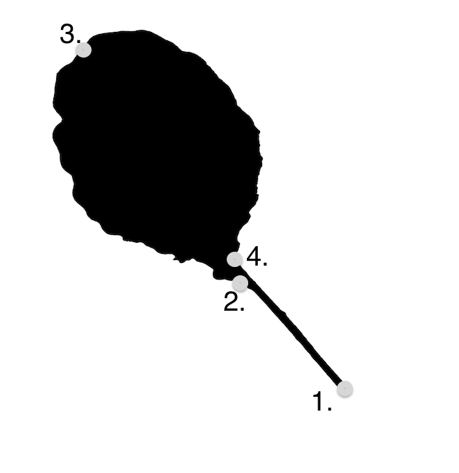

# Morphometric analysis of Brassica oleracea leaves 

This repo includes scripts and processed data for a morphometric analysis of leaf scans in a diversity panel of Brassica oleracea and wild C genome relatives. The goal is to examine variation in leaf shape across developmental stages (leaves 2, 3, and 4) and accessions. 

## Prerequisites
* R v3.6.0 
* [PlantCV v3.3.0](https://github.com/danforthcenter/plantcv) 

## Image preprocessing steps 

1. Convert scans (RGB colorspace) to binary images (python/PlantCV)
2. Split images into individual leaves (python/PlantCV)
3. Export traditional morphometric descriptors (R/Momocs)
4. Compute Elliptical Fourier Descriptors (EFDs) to describe leaf contours (R/Momocs)
5. Landmark images to facilitate alignment 
   

## Authors

* **Sarah Turner-Hissong**
* **Makenzie Mabry**
* **Evan Gallagher**

## License

This project is licensed under the MIT License - see the [LICENSE.md](LICENSE.md) file for details

## Helpful resources
[Comprehensive Methods for Leaf Geometric Morphometric Analyses](https://bio-protocol.org/e2269) by Laura Klein and Harlan Svoboda 
